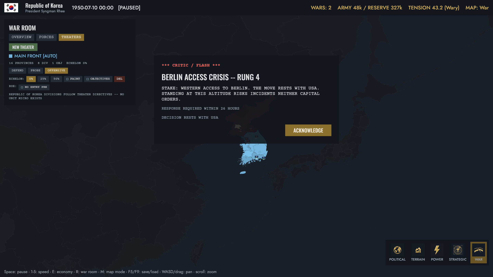

# Development log

How this game is actually being built — decisions, mistakes, and numbers.
Built in Rust + Bevy with Claude Code driving development and agent-swarm
research workflows; that's part of the story and we don't pretend
otherwise. Newest first.

---

## 2026-08-26 — Legibility pass: real toggles, tooltips, and the WAR map view

Player feedback from the first sessions with the command layer, all of
it fair: toggles looked like plain buttons (am I enabling or disabling
this?), nothing explained itself, painting a theater silently did
nothing until you unpaused, and the theater overlay was gizmo circles
where every other view is painted provinces. Four fixes:

- **Stateful controls now show their state.** A shared widget set:
  on/off toggles with an indicator square (lit gold when on, red for
  restrictive things like ROE bans), and radio segments where exactly
  one option is lit — posture is now DEFEND | PROBE | OFFENSIVE, not a
  mystery-cycle button.
- **Hover tooltips everywhere** — every control and the key info lines
  in the war room, economy, atomic, and intel panels explain what the
  thing does and what it costs, in-fiction where possible.
- **Commands apply while paused.** The interesting one: command
  application moved out of the tick entirely and became a
  *between-ticks flush*, logged as "applied after tick T." The replay
  machinery flushes at the same boundaries, so a theater painted while
  paused appears instantly AND replays bit-identically — verified by a
  new test that issues commands with zero ticks running and diffs
  digests. Pausing to give orders is how this genre is played; it had
  to be first-class in the determinism model, not an exception to it.
- **WAR is a real map mode now** (fifth button, new icon, in the M
  cycle): your theaters fill their provinces in theater colors with
  the same vertex-color styling as every other mode, objectives glow
  bright, enemy ground burns dark red, the rest of the world recedes.
  Painting a theater switches to it automatically. The gizmo-circle
  overlay is gone and unmourned.

## 2026-08-26 — The map gets a pulse: tension-band music

A light music pass on the campaign map, following the
[audio design](design/systems/audio.md)'s core identity: near-silence IS
the Calm state, and a blindfolded player should be able to estimate the
tension band by ear. Calm/Wary plays a barely-audible ambient bed (CC0
tracks we already had on disk, unused since the audio research session);
Crisis wakes the room with a tenser piece; and Brink does what the
design demands — *strips the music away*, down to a synthesized bare
pulse (45 BPM sub-bass under one thin tone, generated loop-clean by our
stdlib-only synth script, so it's legally bulletproof). Band changes
need 8 held seconds before the music follows — tension jitter at a
boundary can't flap the mix — and pausing ducks the volume instead of
stopping it, which reads exactly like holding your breath. Whole-track
crossfades for now; the synced stem mixer and stingers still wait on
the bevy_kira_audio migration.

## 2026-08-26 — The army becomes yours: theaters, readiness, force generation

Playtesting verdict was blunt: outside of answering popups the player had
almost nothing to *do*, least of all at war — four hardcoded US divisions
marching as one blob, no way to raise more, no reserves, no fronts. This
session shipped the fix: the
[military command layer](design/systems/military-command.md), the
operational altitude the
[military architecture](design/systems/military.md) always intended.

- **Force generation is real now.** `military_stock` — accruing since the
  economy landed, spent by nothing — buys divisions (infantry 3 / motorized
  5 / armor 8), which spawn green at 10% strength and train for 90–150 days
  (committing them early is a legal, bad, very Korea decision). Upkeep
  triples overseas, and an unpaid army *melts* — the KPA is carried by
  Soviet aid via a new `GrantStock` event effect, which is historically
  honest.
- **Readiness is a brinkmanship signal**: Reserve→Active takes 21 days and
  prints on both wires; raising at peace costs tension. Pillar 1, not
  bookkeeping.
- **Theaters replace the blob-march.** Paint provinces, set
  Defend/Probe/Offensive, click up to 3 objectives, hold back an echelon,
  and check "no entry" per enemy — the Yalu ROE is one checkbox. An
  assignment-preserving quota controller (largest remainder + retarget
  cooldowns) spreads divisions along the front instead of re-dealing them
  daily — the front-shuffle disease the research warned about.
- The design doc went sketch→designed→implemented in one arc, with a
  game-designer stress test that caught 12 real issues before code —
  including "the US can't legally operate in Korea" and "nothing stops a
  30-division US snowball." Both fixed in the spec, then built.
- Also fixed: two notification popups stacking into one unreadable modal
  (three unordered Bevy systems each spawning before seeing the others'
  deferred spawns — `.chain()` and the guard actually guards).

55 sim tests pass, including the full historical arc (invasion → US
intervention → Chinese entry → armistice) running under the new movement.

## 2026-08-25 — The fog gets a price: espionage v1

The intelligence pillar is playing. Its whole thesis — that the game
already trades in beliefs, so intelligence is just the system that moves
them — held up in the code: the first thing built was one four-domain
penetration score per (viewer, subject), and wiring it into the four
consumers that already existed took a handful of lines each.

**Nuclear** penetration now shrinks the deterrence opacity bias. This
one needed a fix that turned out to be the right model anyway: the
program's own exposure accumulator was saturating to certainty within
two years, which is historically false — the US never knew the exact
Soviet count. Capping passive exposure at 700 leaves a residual
count-uncertainty that only real collection closes, so spying on a
*known* nuclear power still collapses the overestimate. That is the
bomber gap, and its cure. **Economic** penetration slides a rival's
observed industry from Gosplan's reported figure toward the truth,
flagged AS REPORTED / FIGURES SUSPECT / TRUE. **Military** penetration
drives the war-room estimate widths that used to be hardcoded fuzz.
**Political** feeds the crisis resolve band.

The doing half is deliberately small: one abstract network per pair
(no agent roster — every genre precedent says names are narrative, not
units), funded 0-3, that both collects and, when spent on sabotage or
design theft, burns the strength it was collecting with — the OSO/OPC
tradeoff as one number. Operations roll blown-vs-clean from a labeled
fork; a blown op spends deniability and spikes tension (doubled when
your denials are already worthless — the U-2 problem). Counterintel
sweeps catch the loudest hostile network and hand a player defender a
spy-trial choice; defectors walk in from unstable rivals with a truth
snapshot. Steal-designs pierces the target's nuclear opacity and, if
you have a program of your own, speeds it — Fuchs, mechanized.

The historical spine got its espionage beats: Burgess and Maclean
vanish in 1951, the Rosenbergs are executed in 1953, Petrov defects in
1954, alongside the Fuchs arrest already there. New Intelligence panel
on I (coverage grades, never raw numbers). 54 tests green; determinism
holds with the whole layer active, and the Korea arc still runs clean
through the new deterrence math. v1.5 (mole hunts, turned agents,
swaps) and v2 (overflights, Venona decrypts) are next when they are.

---

## 2026-08-25 — Researching the shadow war

With the nuclear pillar keying deterrence off what rivals *believe*, the
intelligence pillar is the obvious next build — it's the machinery that
moves those beliefs. A five-analyst swarm covered genre spy mechanics
(what makes them a chore vs a game), the intelligence-quality economy,
sourced 1945-62 tradecraft, covert-operation design, and how the layer
couples to everything already built. Write-up in
[espionage research](research/espionage.md); the
[design doc](design/systems/espionage.md) is now **designed**.

The findings were bracingly consistent. Every shipped grand-strategy spy
system broke the same two ways — mandatory maintenance chores (HoI4's
capture-rescue treadmill, "spy system too tedious" is a real forum
thread) and payoffs too weak to change a decision — and Twilight
Struggle got the feel right by having no spy subsystem at all, making
covert action the opportunity-cost structure of the whole game. So: no
agent roster (names are narrative, not units), networks that never decay
from inaction, risk as a legible exposure clock rather than a die roll,
and outcome *ladders* (named world-states with PROBABLE/POSSIBLE
likelihoods) instead of the XCOM 95%-miss betrayal.

The elegant part is how little new machinery it needs. Intelligence is
one four-domain penetration score per (viewer, subject) — nuclear,
military, economic, political — and each domain maps 1:1 onto a consumer
that already exists: the deterrence opacity bias, the war-UI fuzz
widths, the planned economy's reported-vs-actual books, the crisis
resolve band. The first commit wires those four couplings before any new
content, so every system visibly sharpens the moment you can see through
the fog. A single overflight collapsing the bomber gap the way one
Saratov-Engels photo did; a network that both collects and, when spent
on sabotage, burns the estimates it was feeding you; blown ops becoming
the crisis system's pretext factory with deniability as the damping
currency. And the historical spine writes itself — Fuchs, Burgess and
Maclean, the Rosenbergs, Petrov, the U-2 shootdown that killed the Paris
summit, Corona deflating the missile gap in 1960 (truth arriving can
*lower* tension). Implementation next.

---

## 2026-08-25 — The bomb, in four movements

The flagship pillar went from designed to playing in one long push —
all four phases of the [escalation design](design/systems/escalation.md).

**The program.** Nuclear weapons are an industrial project now, not a
research bar: fissile grams per month from enrichment and reactor
levels, throttled by your regional grid (the complex visibly loads it —
Oak Ridge style) and by uranium feed drawn from the same deposit stocks
the economy mines. The 1950 seeds are sourced: the US at 299 warheads
(only 60 assembled — cores sat in civilian custody), the USSR at 5,
Britain mid-program with Windscale under construction. Left alone, the
sim produces Hurricane off the coast of Australia around 1952-53 and
Ivy Mike on schedule, each detected by sampling flights and announced
on the wire. The H-bomb decision lands on campaign day 31; Fuchs is
arrested on day 33. The atomic dossier (B) shows your program exactly
and everyone else's as National Intelligence Estimate cards that are
allowed to be wrong.

**Deterrence.** What deters is what the rival *believes* you can land:
believed-deliverable = assembled × an opacity bias (estimates run high,
per the bomber-gap record; parade deception inflates them further, at
a price) × physical reach — integer great-circle math from real basing
provinces against real cities. In 1950 the dyad is ONE-SIDED (SAC
reaches Moscow via UK basing; Tu-4s reach CONUS only one-way); as
bomber generations improve it turns MUTUAL mid-decade, and from that
moment war between the peers stops being declarable. The strategic map
mode is the dark phosphor big board: amber wash where your bombers
reach, red where theirs do.

**Crises.** Kahn's ladder, kept to its firebreaks: 8 rungs, incidents
rolling in basis points per hour while you sit at altitude (multiplied
by alert levels — Schelling's threat that leaves something to chance),
resolve as the currency of backing down, the ball passing with each
escalation, deadlines that default to the cautious option. Berlin,
the Taiwan Strait, and the Turkish Straits are authored flashpoints;
under mutual deterrence they come twice as often.

**The trap, and the end.** When your front collapses and the bomb is
available, the theater commander *asks*. Battlefield use works — it
shatters the divisions in the target province — and that is the trap:
civilians die out of the real cohorts, the taboo breaks for everyone
forever, and the enemy's patron opens an ultimatum crisis at the
nuclear rung. Climb past it and the campaign ends: the teletype prints
the cities from the real demography, the exact dead (there is no one
left to estimate), the attribution from the command log, and how long
the peace held. We do not reward failure.

Getting the Korea arc to survive the new physics forced two events
history was owed anyway: the Inchon landing and Ridgway's Eighth Army
rebuild — the arc test now runs invasion → Inchon → Chinese
intervention → stalemate → armistice with the crisis engine live.
48 tests green, determinism suite intact (one lesson: `SimRng::fork`
advances the parent stream, so quiet systems must not fork "just in
case" — rolls you don't take still change the war).

---

## 2026-08-25 — The gun on the wall: researching the nuclear pillar

The game's flagship pillar — escalation & nuclear brinkmanship — has
been a tension meter and a sketch. Time to design it properly. A
five-analyst swarm covered genre acquisition mechanics, deterrence and
use design, sourced historical numbers, war-room UI precedents, and
crisis/brinkmanship theory (Kahn, Schelling, Tannenwald). Write-up in
[nuclear weapons research](research/nuclear-weapons.md); the
[escalation design doc](design/systems/escalation.md) is now
**designed**, not sketch.

The convergent findings that shaped it: the bomb was an *industrial*
undertaking (63% of the Manhattan Project was Oak Ridge isotope
separation; enrichment drew whole-gigawatt blocks — our regional grids
and uranium deposits can model what no other game has); deterrence
should key off the rival's *estimate* of your arsenal, not the truth
(the bomber gap was ~10x wrong, the missile gap saw four real Soviet
ICBMs against NIEs of hundreds — so parade deception becomes a playable
covert action); crises get Kahn's *firebreaks* without his 44 rungs,
with Schelling's "threat that leaves something to chance" as a
deterministic incident hazard that climbs the ladder while you sit at
altitude; tactical use is the designed trap (the MacArthur chain — it
wins the battle and breaks the world); and the failure state follows
Crawford's rule: no mushroom-cloud spectacle, just the teletype
printing real city names from our real demography until it garbles
into TRANSMISSION ENDS, an attribution chain from the command log, and
the date the peace failed. We do not reward failure.

Historical spine locked with sources: US 299 warheads at campaign
start (mostly unassembled, in civilian custody) vs 5 Soviet; the
H-bomb decision lands on day 31 of the campaign; Fuchs is arrested
day 33. The first implementation phase — programs, facilities on real
grids, the test arcs, NIE cards — is next.

---

## 2026-08-25 — Divisions get names, homes, and graves

Second legibility pass, straight from the research's "cheapest
high-impact change" finding: Victoria 2's soldier POPs. **Every division
is now raised from a named home province and named after it** — the ROK
fields the 1ST SEOUL INFANTRY, the KPA the 2ND P'YŎNGYANG ARMOR.
Expeditionary forces raise from their nation's most populous province,
so American divisions in Korea carry a hometown too. And it isn't
cosmetic: **war dead debit the home province's actual population**,
rural cohort first (the armies of 1950 were drafted off farms). The
demographic ledger and the casualty ledger are now the same ledger.

Divisions in transit trail **movement arrows** on the map (own forces in
nation color, enemies dim red) — the last teleport perception gone. The
battle inspector lists your engaged divisions by name with strength and
cohesion, which reads less like a spreadsheet and more like a casualty
list being typed somewhere in a basement.

The war room gained the research's **momentum score**: a -100..+100
tug-of-war bar per war, decomposed into ground (±40), casualty exchange
(±30), and the run of battles (±15) — every term printed, EU4-style
trustworthy, plus a generated verdict ("ASSESSMENT: YOU ARE LOSING --
THE GROUND WAR RUNS AGAINST YOU") and an amber warning when
the manpower reserve drops below a quarter of fielded strength.

38 tests green. Still deferred, deliberately: pre-battle forecast
cards, a real intel stat, and the casualty trend chart.

---

## 2026-08-25 — No more magic armies: the war becomes readable

The director's complaint, verbatim: *"I want way more info when watching
a war... where are these troops coming from (seems like magic right
now!)... I cannot tell why I am losing as the US."* Fair. Armies spawned
from the order of battle and event effects with no visible connection to
anything, combat resolved invisibly, and the war room told you almost
nothing. A four-analyst research swarm (map counters, battle windows,
war dashboards & intel estimates, manpower pipelines — write-up in
[war legibility](research/war-legibility.md)) converged on a plan, and
most of it shipped the same day.

**The armies come from people now.** Every country seeds a manpower pool
at 1.5% of its actual simulated population; belligerents mobilize
another 0.2% per month; formations resting on friendly soil draw
replacements from the pool at 15 strength/day, one strength point = ten
men. The HUD carries a standing **ARMY 210k / RESERVE 480k** headline,
and the war room opens with a conservation-of-mass pipeline — POP >
RESERVE > FIELD > DEAD — where the buckets visibly reconcile. When the
reserve runs dry, reinforcement stops, and you can watch it coming.

**Combat became watchable.** Contested provinces get pulsing red
markers. Unit counters grew HoI4-style dual bars (strength along the
bottom, cohesion up the side) plus a men figure — and enemy stacks show
a *fuzzed count band* ("2-4?"), dimmed, no bars: fog of war as period
flavor. Clicking a battle opens the inspector: balance-of-power bar,
both sides' divisions, men, cohesion and per-hour attrition, an inline
signed modifier ledger (MOUNTAIN +60% · HOME GROUND +20%), a projection
("DEFENDER BREAKS IN ~9H AT CURRENT RATE"), and — the thing no Paradox
game ships — a generated one-line diagnosis: *YOU ARE LOSING PRIMARILY
BECAUSE: ENEMY MOUNTAIN DEFENSE (+60%).*

**Intelligence estimates, done the WitP way.** Enemy strength and losses
appear as ranges rounded to two significant figures, re-sampled monthly
(display-side deterministic hash — the sim RNG is never touched), while
your own losses are always exact. "ENEMY LOSSES EST 12k-19k · OURS
8,400 (EXACT)" is a very Cold War sentence.

**And the war got a memory.** The sim keeps a wire-service ticker —
battle openings, divisions destroyed, provinces taken — capped at 60
lines, and the war room prints the last eight: `[-3D] PRK FORCES TAKE
SEOUL`. Losing is now a story you can read backwards.

A new sim test drives the Korean invasion month hour-by-hour and asserts
the whole apparatus fills in: battles visible with men and hourly losses
counted, ticker lines for openings and captures, win/loss tallies on
both sides, manpower pools seeded and draining. 37 tests green;
determinism and save-replay untouched (manpower joined the digest, since
it feeds reinforcement).

---

## 2026-08-25 — The guns fall silent: armistice, the war room, and the teletype speaks

**Wars now end the way Cold War wars ended** — at the line of control.
Each month, belligerents weigh willingness: non-player countries become
ready after ten months of war with a front frozen for two (or with a
broken army); the player must offer explicitly, from the new **war room
panel** (R): per-enemy posture toggles (ADVANCE/HOLD) and an OFFER
ARMISTICE button, all flowing through the command queue. When both
sides are willing, the wire service reports: *"HOSTILITIES SUSPENDED
ALONG THE PRESENT LINE OF CONTACT... THE LINE IS THE BORDER NOW, UNTIL
IT ISN'T."* Occupation freezes into the new map. Total collapse (no
army, no home provinces) ends a war unilaterally — so a Korea where
America stood aside also concludes, just differently.

The full-arc test now runs invasion → intervention → Chinese entry →
**armistice** — Korea ends divided along an emergent line, tension
bleeding off as the guns stop. Sim knows who the player is via a
SetPlayerCountry command (in the replay log, so armistice AI never
auto-decides for a human).

**And the teletype finally speaks.** Per the audio direction, we
synthesized it rather than sampling: a stdlib-only Python script
generates the print-head strikes (filtered noise bursts with platen
thumps over a 50 Hz motor hum) and the EBS-style 853+960 Hz attention
signal — pure tones and noise, legally bulletproof, seeded for
reproducible assets. Every FLASH TRAFFIC modal now clatters; war
declarations add the two-tone alert underneath. 36 tests green.

## 2026-08-25 — Intervention: choices, deadlines, and the Yalu tripwire

The escalation systems earn their keep. Events grew from date-fired
announcements into a real decision engine: **condition triggers**
(days-into-a-war, provinces-lost tripwires), **daily chance rolls** from
the seeded RNG, and **choice events with deadlines** — the deciding
country gets options; if nobody answers in time, the historical default
applies. Decisions flow through the command queue, so they're part of
the save/replay log like everything else.

Two events use it to complete the Korea arc. Day 5 of the war,
Washington gets *"KOREA: THE PRESIDENT MUST DECIDE"* — COMMIT US GROUND
FORCES or STAND ASIDE. Playing the USA you choose; playing anyone else
you watch a modal marked "DECISION RESTS WITH USA" and wait. And when
the UN side pushes north and the KPA starts losing its own provinces,
the **Chinese intervention tripwire** arms — a daily roll until, one
morning, the teletype reads *"AN ENTIRELY NEW WAR."*

The test is the whole pitch in one function:
`the_korean_war_runs_its_historical_arc` — peace until June 24;
invasion; the US decision fires day 5 and auto-commits at its deadline;
four American divisions land at Busan; the counterattack retakes the
south and crosses the parallel; China enters; the war grinds on with
both coalitions standing. Nobody scripted the sequence — only the
triggers. And `player_can_stand_aside` proves the counterfactual is one
button away: option 1, no Americans in Korea, and the peninsula goes
red. 36 tests green.

## 2026-08-25 — June 25, 1950

The trigger is pulled. The game now has an **event system** (scripted
historical beats in data: the Sino-Soviet Treaty in February, the
invasion in June), a **military core** built to the researched
architecture's Korea-slice spec — formations with the cohesion-vs-
strength two-track damage model, hourly battles with terrain and
home-soil defense, daily movement with BFS marching toward the front,
retreats, pocket destruction, and occupation flipping provinces — and
the **June 25 invasion** as a live event: war declared, KPA postured to
Advance, tension spiking +20, a FLASH TRAFFIC teletype modal pausing
the game.

The test that matters is named `the_korean_war_begins_and_seoul_falls`,
and it passes: peace until June 24, invasion on the 25th, the ROK still
fighting at three weeks (armies break before they die), Seoul fallen
and the south overrun by week eight — which is the correct
*counterfactual*: this is Korea WITHOUT American intervention, and
intervention is precisely the next system (the escalation ladder's
job). Watching the debug traces was the session's joy: the KPA reserve
in Pyongyang pathfinding south to the front, armor wandering to mop up
Jeolla pockets, then the whole army converging on a defiant Seoul.

Also shipped: army counters on the map, conquest repainting the
political map live, a WARS indicator in the HUD, and UGS_LOAD for
booting straight into a saved war. Balance passes came from real
failures: first battles ground at 1 cohesion/hour (an over-division
bug), then the ROK evaporated in six weeks (armies now break and
retreat instead), then Seoul held forever (home-soil bonus was too
strong at first cut). 33 sim tests green, military digest in the
determinism suite.

## 2026-08-25 — Saves in kilobytes, and the shape of war

**Save/load shipped** — and the day-one architecture bet paid off: a
save is just (seed, start date, tick, command log), a few kilobytes of
RON no matter how long the campaign. Loading resets the sim and replays
every tick, re-applying your commands on their original hours; the test
proves the replayed world matches the original's full state digest
exactly, then keeps matching as both run onward. F5/F9 in game. The
same machinery is a replay viewer and the multiplayer-lockstep join
path, whenever we want them.

**The military research swarm reported** — 8 analysts across HoI4's
designers and combat math, Rule the Waves, Wargame/WARNO, AGEOD, Unity
of Command, Victoria 3's front failures, Victory Games' 1986 Korean War
board game, and logistics models
([readup](research/military-mechanics.md)). The convergence was even
stronger than the economy swarm: **design deep, command high**.
Equipment design is the player's deep layer (Rule the Waves-style
generations under real budget constraints — and every HoI4 degenerate
meta traced to root causes we can spec away: hidden cliffs, non-additive
stat aggregation, deterministic targeting). Formations are curated
doctrine archetypes, not width puzzles. Combat keeps HoI4's proven
cohesion-vs-strength skeleton. Wars end at the line of control with
armistice as a negotiation state, the escalation ceiling is priced
inside the war (a 1986 board game solved this), and deniability is a
stat espionage can strip. Favorite finding: obsolescence as a cascade —
your retiring T-54s automatically flow to reserves, then to arms
exports, then to proxies. Arming the world with your old tanks isn't
flavor; it's the influence war. The
[military design doc](design/systems/military.md) now carries the
locked architecture, Korea slice first.

## 2026-08-25 — Famine, weather, and the sound of the war room

**Step 4: agriculture** ([design doc](design/systems/agriculture.md)).
Each January every country rolls a harvest (850–1150‰) from the seeded
RNG — the sim's first real use of randomness, fully deterministic. Planned
economies get the two levers history handed them: **grain procurement
quotas** (squeeze the countryside harder — and when the harvest fails,
the famine deaths concentrate rural) and **collectivization**, priced
honestly as the historical gamble: permanently better extraction,
permanently worse yield, and a 12-month transition shock. Food ratios
now feed back into standard of living and, below the famine threshold,
into excess deaths applied straight to the demographic cohorts. The test
suite's grimmest assertion yet: `famine_is_reachable_and_kills`. The
Great Leap is now a reachable outcome of player choices, not an event.
Soviet food sits at 94% with a normal harvest — chronically strained,
exactly as it should be.

**Audio research + first sounds.** A 3-analyst swarm produced the
[audio readup](research/audio.md) with some sharp verified findings:
1950s recordings are copyright-locked until ~2060 (no Fallout-style
needle-drops), the Conet Project numbers-station tapes are actively
litigated (we'll synthesize our own), and FreePD.com is dead but its CC0
catalog lives on archive.org. The direction doc
([audio](design/systems/audio.md)) commits to DEFCON's bunker
philosophy: teletype as our Geiger counter, stingers followed by
enforced silence, and a stem mixer driven by the Tension meter. v1
shipped: CC0 menu music and Kenney UI clicks — and the war room itself
stays silent on purpose.

## 2026-08-25 — The thesis becomes playable: two planning interfaces

Step 3, and the reason this game exists
([design doc](design/systems/planning-interfaces.md)): every country now
runs one of two economic systems over the same production substrate.
Monthly output — throttled by regional power and coal — splits into
consumer goods, investment, and military. **Planned economies set the
quantities**: quota rows in 5% steps, and their statistics bureau pads
disappointing results (the player's own dashboard shows *reported*
industry, capped at +15% above reality — the espionage pillar will
eventually let rivals know your economy better than you do). **Market
economies set the parameters**: interest, taxes, procurement; firms
decide the split, statistics are honest, and loose money shows up as
inflation that eats living standards.

The loop is closed: allocation → consumer goods → standard of living →
birth rates, urbanization, education. Guns-versus-butter now has
demographic teeth. Press E in-game: Stalin gets STATE PLANNING with
"(figures as reported by Gosplan)"; Truman gets ECONOMIC POLICY with
"firms set output; you set the terms". Same panel skeleton, different
verbs — the first-hour difference the research demanded.

The five new tests read like the design goals: heavier investment grows
industry faster; cheap money boosts growth *and* inflation; planned
statistics pad but stay capped; market statistics never lie; commands
aimed at the wrong interface are rejected. 32 tests green, economy
digest in the determinism suite.

## 2026-08-25 — Resources, deposits, and the unelectrified world

Step 2 of the economy build order
([design doc](design/systems/resources-and-grids.md)): the world now has
**243 economic regions** (spatial clustering of provinces, never crossing
a country border), **51 hand-placed 1950 resource deposits** — Donbas and
Ruhr coal, Ghawar and Baku oil, Shinkolobwe uranium correctly in the
Belgian Congo — and monthly **national balances** for grain, coal, oil,
and steel plus **regional electricity** where shortage softly throttles
(never below 50%, per the research).

The new Power map mode is the payoff: press M twice and the 1950 energy
map appears — the American/European/Soviet industrial cores green, the
entire decolonizing world red. Nobody scripted that; it falls out of
industry distribution and urban population. Grain comes from rural
cohorts × terrain, so the demography system now feeds the economy — the
first real inter-system dependency. Uranium accumulates into national
stockpiles, inert until the weapons-program chain lands.

Amusing bug from nearest-province deposit assignment: Saudi oil initially
went to Bahrain, Katanga's uranium to Northern Rhodesia, and Lorraine's
iron to Luxembourg — all fixed by nudging coordinates, but a good
reminder that "nearest center" and "inside the polygon" are different
questions. 27 tests green, including "the unelectrified world should
exist" (>20 regions at full power AND >20 starved).

## 2026-08-25 — First mechanics: demography lands

The economy research locked "population is the universal denominator" as
principle #3, so demography is the first real mechanic:
[design doc](design/systems/demography.md). Every province now carries
three continuous cohorts (rural / urban / educated) in integer persons,
seeded from the HYDE census data — we extended the mapgen pipeline to
carry urban counts through (New York: 9.5M urban of 14.6M; Seoul: 844k of
2.9M). Monthly, each province applies birth/death rates driven by a
standard-of-living score, plus rural→urban migration and an education
conversion.

The satisfying part: the calibration test runs ten game-years (87,600
hourly ticks) and asserts world population growth lands in the historical
1950→1960 band (2.53B → ~3.0B) — and it does, first try, from two linear
vital-rate formulas. Death rates came out eerily close to history (USA
model 9.4 vs actual 9.6 per 1000; India 28 vs 28). Birth rates are the
honest weak spot: the Western baby boom defies any SoL curve, so the doc
carries a per-country-override TODO.

All integer math, `BTreeMap` iteration only, and the cohort digest is now
part of the interleaved determinism test. 24 tests green.

## 2026-08-25 — What the genre taught us about economies

Before implementing any economy, we ran an 8-agent research swarm across
HoI4, Victoria 2/3, EU4, Supreme Ruler, Workers & Resources, the Cold War
niche games, Civ, and Stellaris plus design literature. The analysts
worked independently and converged on the same principles — the readup
([economy-mechanics](research/economy-mechanics.md)) distills ten of
them. The big one: planned economies set *quantities* while market
economies set *parameters*, over one shared stock-flow simulation. Also:
never let a currency purchase itself (HoI4's civ-snowball), never let
electricity be money (Stellaris), and model the bomb as a supply chain
with an intelligence footprint, not a research slider. The
[economy design doc](design/systems/economy.md) is rewritten around this
architecture.

## 2026-08-25 — Map-first nation select, fonts, and a proper HUD

The 86-row country list died; the world map is now the country browser.
Click any province → its owner's dossier pops over the map (period flag,
leader photo, government, typewriter-set situation text, PLAY). Typeface
research settled on Oswald / Jost / Courier Prime (all SIL OFL) — Jost
because it's the Futura lineage, and Futura *is* mid-century modernism.
In-game there's now a real top bar (your flag, leader, date, tension) and
a province card with live cohort numbers.

Lesson learned the hard way: Bevy's initial-state `OnEnter` runs before
`Startup` systems, which bit us three separate times (world data, camera,
player nation). Everything a screen needs at first paint now gets
inserted at app-build time.

## 2026-08-25 — Map polish: one mesh, real borders

The map was 13,782 mesh entities and it showed at overview zoom. Now the
whole political fill is a single vertex-colored mesh (9 drawn entities
including borders, across the 3 wrap copies); map modes recolor by
rewriting a province's slice of the color attribute. Country borders are
extracted in mapgen from the raw Natural Earth shared-edge topology —
segments touched by two different owners, chained through junctions into
250 polylines — so the Yalu and the 38th parallel read as real frontiers.
Since border lines are world-unit geometry, they fade at overview zoom
and sharpen close-in: free level-of-detail.

## 2026-08-25 — 86 nations, researched and playable

An 8-agent swarm wrote dossiers for every 1950 nation: de-facto leader on
January 1st exactly (Syria mid-coup-cycle was the hard one), period
government labels, and two paragraphs of situation text each. The asset
pipeline pulled 86 period-correct flags and 84 leader photos from
Wikimedia Commons with licenses recorded; nano-banana 2 painted the
war-room menu background and the two portraits history didn't leave us
(Andorra, San Marino). One deliberate deviation from strict history:
occupied Japan keeps its own tag rather than being owner=USA, so it can
exist as an actor. Full sourcing in
[sovereignty-1950](research/sovereignty-1950.md).

## 2026-08-25 — A world from open data

4,594 provinces from Natural Earth admin-1 (public domain), 1950
ownership researched country-by-country (86 sovereign entities — the
British Empire alone is 923 provinces), population from HYDE 3.2.1
(world total: 2.53B modeled vs ~2.5B actual; USSR 181M vs 180M; Japan
83M vs 83M), terrain classified from ETOPO5 elevation + Köppen-Geiger
1931–1960 climate + urban density. Favorite trick: HYDE's archive is one
5.3GB Deflate64 zip, so the fetch script reads the zip's central
directory over HTTP Range requests and extracts just the two 1950 grids —
10MB transferred. CShapes (the academic historical-borders dataset)
turned out to be CC BY-NC, so we ship none of it: 1950 borders emerge
from our own ownership layer over public-domain geometry.

## 2026-08-25 — Foundations

Cargo workspace with a hard wall between `ugs-sim` (deterministic,
headless, bevy_ecs only) and `ugs-app` (Bevy presentation). One tick =
one in-game hour; all randomness through a seeded PCG32 with forkable
per-subsystem streams; saves will be seed + command log. The determinism
test interleaves two apps tick-by-tick for 90 game-days and asserts
bit-identical state — interleaved specifically to catch global-state
leaks that sequential runs would miss. First mechanics through the
pipeline: the Global Tension meter and the command queue that is the
only doorway into sim state.
