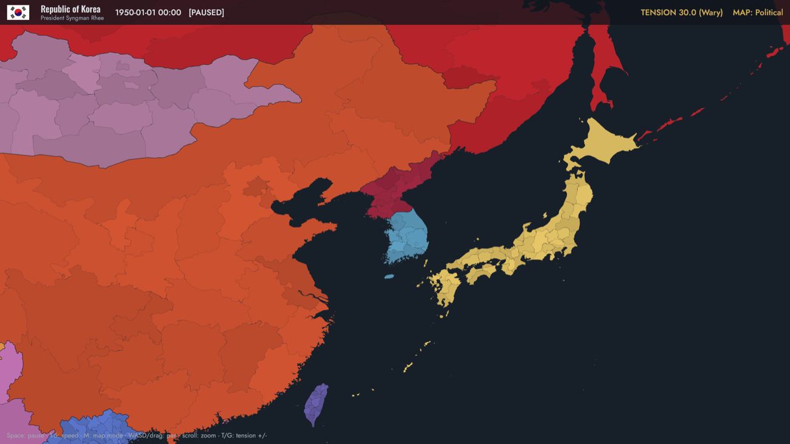
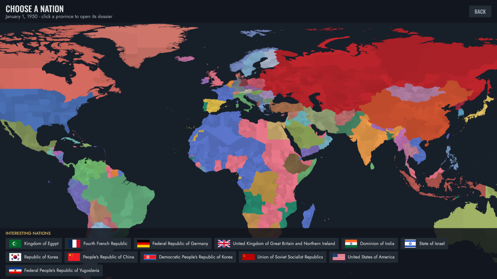
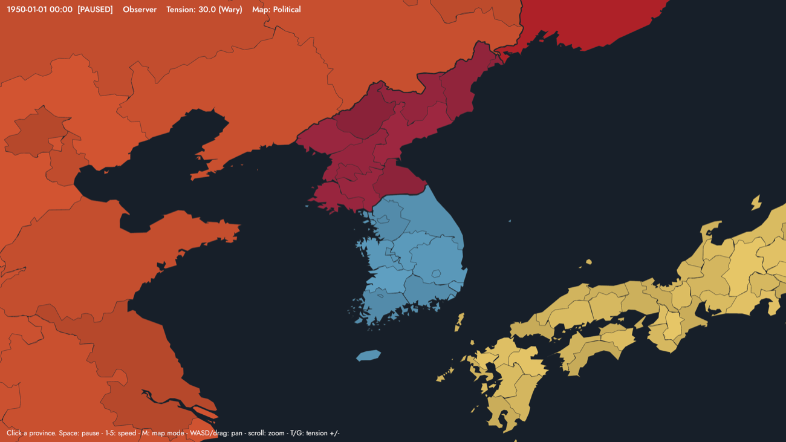
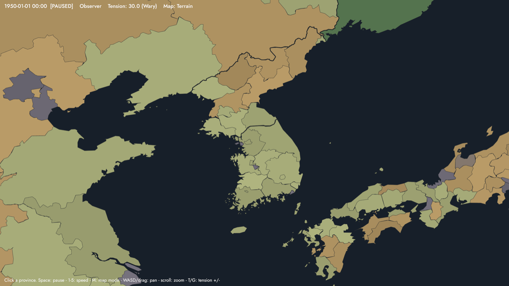
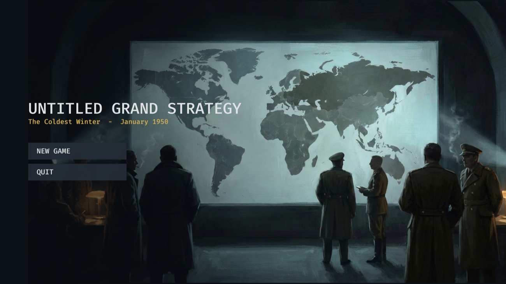

# Untitled Grand Strategy

**January 1st, 1950.** The Iron Curtain has fallen across Europe, Mao has won
China, and the Soviet Union has the bomb. In six months, North Korea crosses
the 38th parallel — and the player gets exactly that long to find their
footing.

A Cold War grand strategy game built in Rust with [Bevy](https://bevy.org).
Real-time-with-pause on a 4,594-province world map generated from real
geodata. Inspired by Hearts of Iron IV, but its own game: **total war is the
failure state.** You win the century, not the war.

## The four pillars

Every mechanic serves at least one of these, or it gets cut:

1. **Escalation & nuclear brinkmanship** — tension is a first-class
   resource; wars are fought under escalation ceilings both sides
   manipulate; the bomb is the gun on the wall that everyone must point and
   nobody may fire.
2. **Ideology & influence warfare** — the map is painted by alignment, not
   just occupation: elections, coups, aid, propaganda, decolonization.
3. **Intelligence & covert ops** — what your rival *believes* matters as
   much as what is true; deniability is a currency.
4. **Economic systems competition** — central planning and market economies
   as genuinely different rule sets, arms racing under real budget pressure.

## The world

The map is generated from open data — Natural Earth admin-1 boundaries
(public domain), HYDE 3.2.1 population for exactly 1950 (CC0; the world
total comes out 2.53B against a real ~2.5B), ETOPO5 elevation, and the
Köppen-Geiger 1931–1960 climate map (CC BY 4.0) for terrain. The 1950
borders — colonial empires intact, Germany and Korea divided, the Soviet
republics as one crimson mass — are our own researched ownership layer
over those public-domain atoms.

All 86 nations of the 1950 international system are playable, each with a
researched dossier: the leader who actually ran the country on New Year's
Day 1950, the period-correct flag (Canada's Red Ensign, Egypt's kingdom
green, East Germany's plain tricolor), and a historic situation briefing.

## Design documents

- [Vision — what this game is and is not](design/vision.md)
- [Global Tension](design/systems/tension.md)
- [Escalation & nuclear war](design/systems/escalation.md)
- [Influence & ideology](design/systems/influence.md)
- [Intelligence & covert ops](design/systems/espionage.md)
- [Economy](design/systems/economy.md)
- [Military](design/systems/military.md)
- [Terrain](design/systems/terrain.md)
- [Time & map](design/systems/time-and-map.md)

## Research notes

- [Geodata sources & licensing](research/geodata.md)
- [The 1950 sovereignty mapping](research/sovereignty-1950.md)

## Technical notes

The simulation core is deterministic and headless: one tick is one in-game
hour, all randomness flows from a seeded generator, and two simulations
with the same seed and command log stay bit-identical over years of game
time (verified by interleaved divergence tests). Saves, replays, and
multiplayer lockstep all fall out of that one property. The renderer draws
the whole political map as a single vertex-colored mesh, with country
borders extracted from the raw shared-edge topology of the source data.

*All asset sources and licenses are recorded in
[CREDITS](https://github.com/polarorb/untitled-grand-strategy/blob/main/assets/CREDITS.md).*
